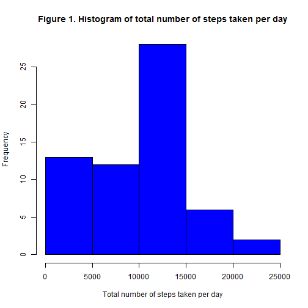
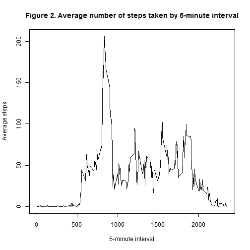
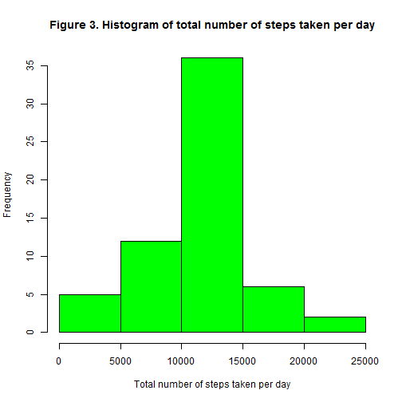
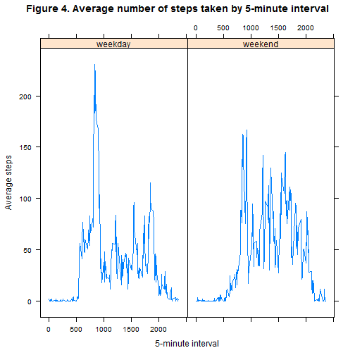

---
---
## Introduction

It is now possible to collect a large amount of data about personal movement using activity monitoring devices such as a Fitbit, Nike Fuelband, or Jawbone Up. These type of devices are part of the "quantified self" movement - a group of enthusiasts who take measurements about themselves regularly to improve their health, to find patterns in their behavior, or because they are tech geeks. But these data remain under-utilized both because the raw data are hard to obtain and there is a lack of statistical methods and software for processing and interpreting the data.

The aim of this study is to analyze personal movement.

## Material and Method

**Data**

Data come from a personal activity monitoring device. This device collects data at 5 minute intervals through out the day. The data consists of two months of data from an anonymous individual collected during the months of October and November, 2012 and include the number of  steps taken in 5 minute intervals each day. A total of 17,568 observations are included in the data set.

**Methods**

We used exploratory analysis to answers a set of questions about personal movement. Data have been loaded with *read.csv()* function and any processing was not necessary.Missing value have been replaced with the mean of the variable.


## Results

**Distribution of total number of steps taken per day**

By ignoring the missing values in the dataset:

- The mean of  total number of steps taken per day is **9354.23**

- The median of  total number of steps taken per day is **10395**

Figure 1. shows the histogram of the total number of steps taken each day


 **The average daily activity pattern**
 
 By ignoring the missing values in the dataset:
 
The 5-minute interval, on average across all the days in the dataset, contains the maximum number of steps is **835**

Figure 2. shows  the plot of the average number of steps taken (y-axis) by the 5-minute interval (x-axis).

**Imputing missing values**

The total number of missing values in the dataset is **2034**

Missing values in steps variable have been replaced with the mean of steps variable for each 5-minute interval. We now created a new dataset that is equal to the original dataset but with the missing data filled in.

By taking into account the missing values in the dataset:

- The mean of  total number of steps taken per day is **10766.19**

- The median of  total number of steps taken per day is **10766.19**

Figure 3. shows the histogram of the total number of steps taken each day


These values differ from the estimates from the first part of the assignment.

Imputing missing data on the estimates of the total daily number of steps change the mean and the median of the total daily number of steps:

The mean changed by 15%

The median changed by 3.5%


**Are there differences in activity patterns between weekdays and weekends**

To do that, we created a new factor variable in the dataset with two levels - "weekday" and "weekend" indicating whether a given date is a weekday or weekend day.

The Figure 4.shows that there are differences in activity patterns between weekdays and weekends


```r
#Loading the data in R
setwd("C:/Users/hp Probook 4540s/Desktop/reproductible research/RepData_PeerAssessment1")
#Lecture des données
mec=read.csv2("activity.csv", header=TRUE,sep=",")
```

```
## Warning: cannot open file 'activity.csv': No such file or directory
```

```
## Error: cannot open the connection
```

```r
summary(mec)
```

```
##      steps               date          interval   
##  Min.   :  0.0   2012-10-01:  288   Min.   :   0  
##  1st Qu.:  0.0   2012-10-02:  288   1st Qu.: 589  
##  Median :  0.0   2012-10-03:  288   Median :1178  
##  Mean   : 37.4   2012-10-04:  288   Mean   :1178  
##  3rd Qu.: 12.0   2012-10-05:  288   3rd Qu.:1766  
##  Max.   :806.0   2012-10-06:  288   Max.   :2355  
##  NA's   :2304    (Other)   :15840
```

```r
str(mec)
```

```
## 'data.frame':	17568 obs. of  3 variables:
##  $ steps   : int  NA NA NA NA NA NA NA NA NA NA ...
##  $ date    : Factor w/ 61 levels "2012-10-01","2012-10-02",..: 1 1 1 1 1 1 1 1 1 1 ...
##  $ interval: int  0 5 10 15 20 25 30 35 40 45 ...
```

```r
#Mean total number of steps taken per day
#Aggregating steps per day with sum function
agrsum=aggregate(mec$steps,by=list(mec$date),FUN=sum,na.rm=TRUE)
#Make histogram
hist(agrsum$x, col="blue",xlab="Total number of steps taken per day",main="Figure 1. Histogram of total number of steps taken per day") 
```

 

```r
#Calculate and report the mean and median total number of steps taken per day
mean(agrsum$x)
```

```
## [1] 9354
```

```r
median(agrsum$x)
```

```
## [1] 10395
```

```r
#The average daily activity pattern
#Aggregating steps per day with mean function
agrmean=aggregate(mec$steps,by=list(mec$interval),FUN=mean,na.rm=TRUE)
#Plot time series
plot(agrmean$Group.1, agrmean$x,type="l",xlab="5-minute interval",ylab="Average steps",main="Figure 2. Average number of steps taken by 5-minute interval")
```

 

```r
#Interval wich contains the maximum number of steps
agrmean$Group.1[agrmean$x==max(agrmean$x)]
```

```
## [1] 835
```

```r
#Imputing missing values
#total number of missing values in the dataset
dim(mec)[1]-dim(na.omit(mec))[1]
```

```
## [1] 2304
```

```r
#Filing in all missing values with day mean and 5-minutes interval mean 
#Create a new dataframe equal to mec called mecf
mecf=mec
#create a variable wich contains the mean of steps for 5-minute intervall and replace missing values
mecf$steps1=NA
for (i in 1:length(mecf$steps)){
  don=subset(mecf,mecf$interval==mecf$interval[i])
  mecf$steps1[i] =mean(don$steps,na.rm=TRUE)
  if (is.na(mecf$steps[i])==TRUE)
    {
    mecf$steps[i]=mecf$steps1[i]
    }
    
     }
#Aggregating imputed steps per day with sum function
agrsumf=aggregate(mecf$steps,by=list(mec$date),FUN=sum,na.rm=TRUE)
#Make imputed histogram
hist(agrsumf$x, col="green",xlab="Total number of steps taken per day",main="Figure 3. Histogram of total number of steps taken per day") 
```

 

```r
#Calculate and report the imputed mean and median total number of steps taken per day
mean(agrsumf$x)
```

```
## [1] 10766
```

```r
median(agrsumf$x)
```

```
## [1] 10766
```

```r
#Differnce in mean and median when take into account missing values
(mean(agrsum$x)-mean(agrsumf$x))/mean(agrsum$x)
```

```
## [1] -0.1509
```

```r
(median(agrsum$x)-median(agrsumf$x))/median(agrsum$x)
```

```
## [1] -0.03571
```

```r
#differences in activity patterns between weekdays and weekends
#Converte date variable from char to date format
mecf$date=as.Date(mecf$date)
mecf$week=weekdays(mecf$date)
#Create a weekday variable
mecf$weekd=NA
mecf$weekd[mecf$week=="samedi"|mecf$week=="dimanche"]="weekend"
mecf$weekd[mecf$week!="samedi"& mecf$week!="dimanche"]="weekday"
#Create a panel plot
library(lattice)
#Aggregating steps per day with mean function
agrmean1=aggregate(mecf$steps,by=list(mecf$interval,mecf$weekd),FUN=mean,na.rm=TRUE)

## Plot with 2 panels
xyplot(agrmean1$x~agrmean1$Group.1|agrmean1$Group.2, layout = c(2, 1),type="l",xlab="5-minute interval",ylab="Average steps",main="Figure 4. Average number of steps taken by 5-minute interval")  
```

 
